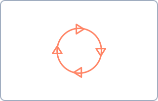
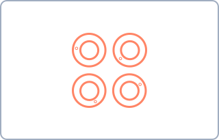
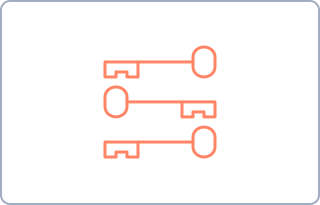
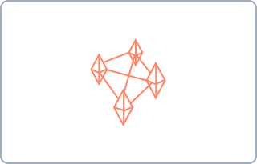
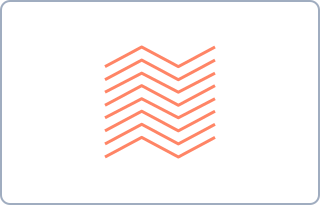
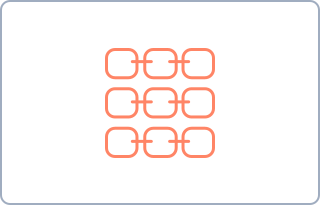

An open library of design patterns for building better user-facing applications backed by decentralized architectures. These patterns help developers and designers understand the unique challenges of decentralized systems and provide proven solutions for common problems.

> [!tip] How to use this library
> Browse patterns by **topic** below, explore them through the **sidebar**, or follow the links between related patterns. Use the **graph view** to discover connections.

---

## Identity & Agency

In decentralized applications, user "accounts" may not exist, or they might get verified in a variety of ways. These patterns help bring clarity to managing online identity and credentials.

See the full [[identity-agency|Identity & Agency]] topic page.

  <a class="pattern-card" href="patterns/address">
    
    Address
  </a>
  <a class="pattern-card" href="patterns/disposable-identity">
    
    Disposable Identity
  </a>
  <a class="pattern-card" href="patterns/host-roulette">
    
    Host Roulette
  </a>
  <a class="pattern-card" href="patterns/persistent-identity">
    
    Persistent Identity
  </a>

---

## Moderation & Curation

Information overload, spam, and abuse are serious problems for decentralized applications. These patterns deal with content moderation and community safety.

See the full [[moderation-curation|Moderation & Curation]] topic page.

  <a class="pattern-card" href="patterns/cautious-optimism">
    
    Cautious Optimism
  </a>
  <a class="pattern-card" href="patterns/conditional-file-sharing">
    
    Conditional File Sharing
  </a>
  <a class="pattern-card" href="patterns/content-curators">
    
    Content Curators
  </a>
  <a class="pattern-card" href="patterns/prioritize-backup">
    
    Prioritize Backup
  </a>
  <a class="pattern-card" href="patterns/social-radius-slider">
    
    Social Radius Slider
  </a>
  <a class="pattern-card" href="patterns/tombstones">
    
    Tombstones
  </a>
  <a class="pattern-card" href="patterns/village-or-city">
    
    Village or City
  </a>

---

## Sharing & Permissions

Most decentralized applications share everything publicly by default. These patterns help build trust by letting users decide who sees what, and when.

See the full [[sharing-permissions|Sharing & Permissions]] topic page.

  <a class="pattern-card" href="patterns/paper-keys">
    
    Paper Keys
  </a>
  <a class="pattern-card" href="patterns/QR-code-verification">
    
    QR Code Verification
  </a>
  <a class="pattern-card" href="patterns/secret-sharing">
    
    Secret Sharing
  </a>
  <a class="pattern-card" href="patterns/standards-marker">
    
    Standards Marker
  </a>
  <a class="pattern-card" href="patterns/visual-hash">
    
    Visual Hash
  </a>
  <a class="pattern-card" href="patterns/whisper-links">
    
    Whisper Links
  </a>

---

## Sync & Status

Decentralized applications are not always connected to a single source of truth. These patterns help users understand data availability, sync status, and discoverability.

See the full [[sync-status|Sync & Status]] topic page.

  <a class="pattern-card" href="patterns/age-indicator">
    
    Age Indicator
  </a>
  <a class="pattern-card" href="patterns/discovery-server">
    
    Discovery Server
  </a>
  <a class="pattern-card" href="patterns/network-health-indicator">
    
    Network Health Indicator
  </a>
  <a class="pattern-card" href="patterns/physical-beacon">
    
    Physical Beacon
  </a>
  <a class="pattern-card" href="patterns/protocol-agnosticism">
    
    Protocol Agnosticism
  </a>
  <a class="pattern-card" href="patterns/trackers">
    
    Trackers
  </a>

